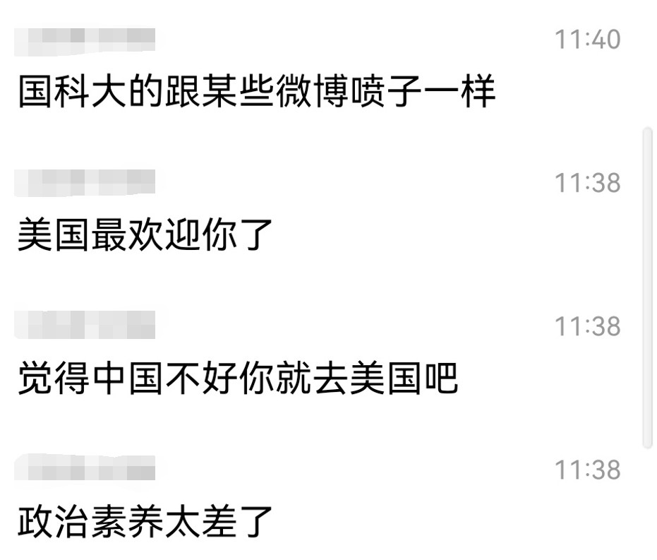
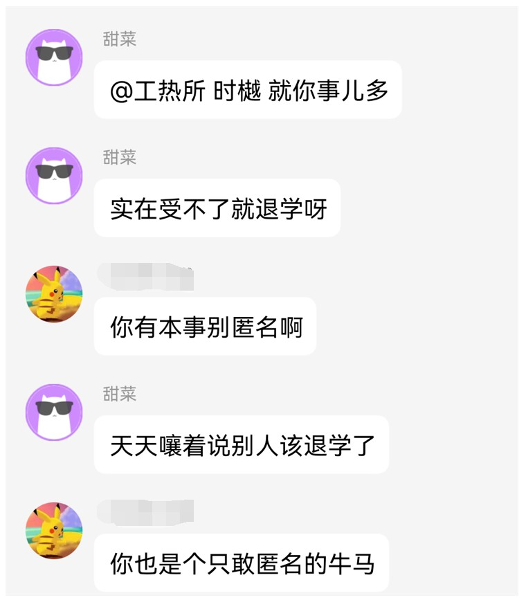
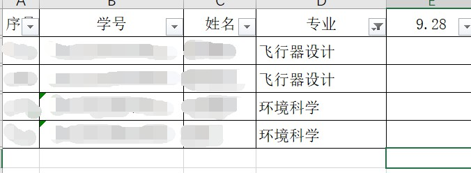
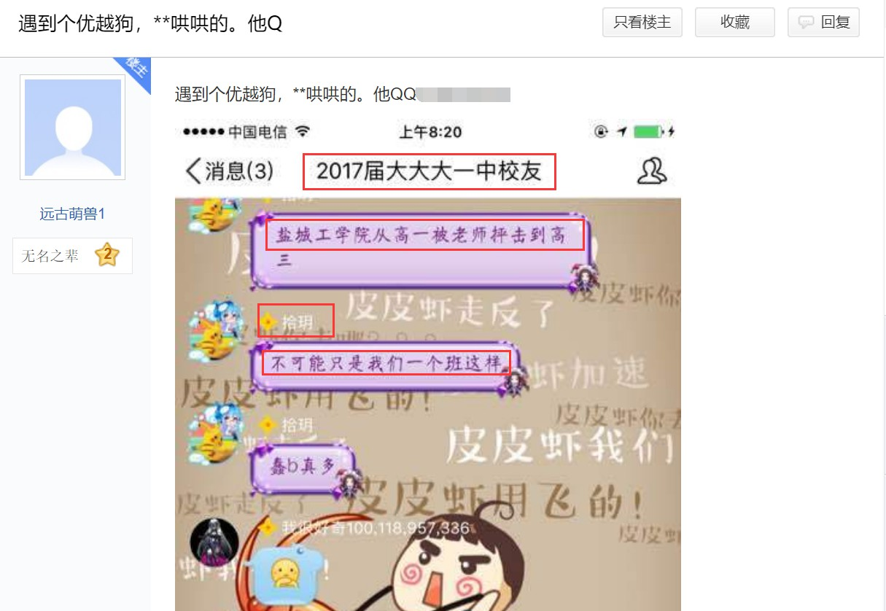

# 记录一次有趣的Baidu Hacking

<u>由于某位同学发言的内容过于离谱，并且大多数时候毫无逻辑，特纪念一次获取相应公开信息的过程。</u>

## 起因

最开始注意到这位同学，是在某个大群里面关于学校政策有关问题“舌战群儒”，给部分同学乱扣帽子。

这次对话让我对其留下了深刻的印象，而他在**学习群**的发言更是**重量级**。

正当其他同学提醒他不要发过于无关内容时，他却说匿名的同学是牛马。

于是简单打开企业微信搜一搜，由于2021级开始企业微信**通过API接口强制实名**，发现他的“研究所-名称”中的**名称**也只是**化名**。由于不是真实姓名，因此直接给出化名为：**时樾**。

因此我综上述内容对这位化名者喷匿名等种种行为进行了一些搜索。

## 过程

首先通过群可以得知这位同学的QQ为12***24022。

通过该QQ号在QQ中搜索，注意到某条发言如下：

发言时间为9月10日，今天的日期为9月29日，**已超过退课日期**，进入中特群，发现这位同学在群里，没有修改昵称，**暂且认为该同学没有退课，并在课程名单上**。

通过该同学**多个群的前缀**并结合**有关发言**，可以暂且认为该同学的确在**工热所**。

于是打开 官方网站中的 [工程热物理研究所2021年硕士研究生招生简章](http://www.etp.ac.cn/yjsbsh/yjsbshsszs/202009/t20200924_5704839.html)

可以知道，**工热所2021年招生专业**分别有：

- 工程热物理
- 热能工程
- 动力机械及工程
- 飞行器设计
- 航空宇航推进理论与工程
- 航空宇航制造工程
- 环境科学
- 环境工程
- 能源动力

因此，打开中特群的签到表名单，对专业进行筛选，得到如下结果，只有4位同学符合要求。

由于**实名**，在企业微信中搜索，发现后3位同学并不在工热所，只有第一位专业为**飞行器设计**的同学符合要求。

因此暂且认为，

1. **选了周二上午中特**
2. **专业为飞行器设计**
3. **研究所为工热所**

姓名为ABC的同学为时樾本人。

再跳转到[中科院工程热物理研究所2021年调剂硕士研究生招生复试结果公示](http://www.etp.ac.cn/yjsbsh/yjsbshsszs/202104/t20210407_5990684.html)，搜索该同学姓名，符合条件，即专业的确为飞行器设计。

***此时已确定其真实姓名，后续操作为进一步证明。***

### Baidu Hacking

> 使用公开搜索引擎对信息进行搜索，是社会工程学的重要途径。

对该同学的QQ12***24022进行百度搜索，发现存在一个爆出他QQ号的[帖子](https://tieba.baidu.com/p/5240467794?red_tag=2274361676)，如下图所示：

从中可以得出3条关键信息：

该同学来自**江苏盐城第一中学**，该同学为2017年本科入学（这里群名届的描述有误，应为级），该同学的确**化名为时樾**（拾玥同音）。

根据信息1，使用姓名ABC和江苏盐城第一中学进行百度搜索，可以搜索到一份：

[东南大学2017年自主招生初审合格名单公示](https://cpho.eduzhixin.com/archives/12490)

从中可以看出，姓名为ABC的同学，的确来自江苏盐城第一中学，排除全国同名的可能性。

并且东南大学为985院校，与调剂名单中ABC同学的本科学校同样为985院校，更加深了真实性。

### 总结

1. 在英语群和各大群使用QQ12***24022离谱发言
2. **使用相同QQ选了周二上午中特**，并加入了周二上午中特群
3. **专业为飞行器设计**
4. **研究所为工热所**
5. 高中为江苏盐城市第一中学

的ABC同学，即为**时樾**。

因此整个逻辑为：

在各大群使用QQ12***24022，并标注自己是工热所 → 使用相同的QQ加入中特QQ群 → 在中特QQ群中用工热所的专业进行锁定 → 得出姓名为ABC

再使用：

贴吧给出QQ12***24022来自江苏盐城第一中学 && 在各大群发言寻找江苏老乡 && 姓名为ABC

→  一份公开的985自主招生名单证明姓名为ABC的人来自江苏盐城第一中学

**综上，该同学姓名为ABC。**

## 有关匿名和就事论事

> “有的人连就事论事的理性都没有，只敢躲在匿名下喷，真可笑”。

**就事论事，你顶个化名在那先喷粪，也是挺可怜的。**

## 声明

**已对所有敏感信息脱敏处理，只给出了公开信息链接，需要看的同学请点击公开链接，其内容与本人无关。**

**侵删，谢谢。**

